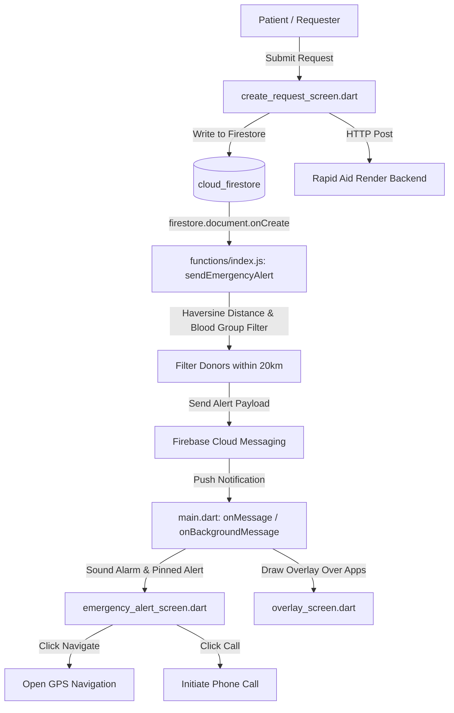

# 🚨 Rapid Aid — Blood & Emergency Response System

Rapid Aid is a premium, real-time emergency response and blood donation coordination mobile application built using Flutter and Firebase. It is designed to bridge the gap between emergency victims, hospitals, ambulance dispatchers, and voluntary blood donors.

With a modern, high-contrast user interface tailored for high-pressure situations, Rapid Aid implements real-time location-based donor matching, automated push notifications via FCM, first-aid AI assistance, interactive pharmacy map searches, and smart NFC emergency card creation and order processing.

---

## 🏛️ System Architecture & Workflow

The following diagram illustrates how a user request triggers real-time alerts across the system:



---

## 📂 Complete File Directory & References

Every source code file, asset, and configuration file in this repository is listed and linked below.

### 🌐 Core Configuration & Metadata Files
*   [pubspec.yaml](file:///c:/Users/munna/Downloads/RapidAidMiniProject/rapid_aid/pubspec.yaml) — Flutter application dependencies, metadata, asset configuration, and font definitions.
*   [firebase.json](file:///c:/Users/munna/Downloads/RapidAidMiniProject/rapid_aid/firebase.json) — Configuration file specifying settings, source directories, and ignored paths for Firebase deployments.
*   [.firebaserc](file:///c:/Users/munna/Downloads/RapidAidMiniProject/rapid_aid/.firebaserc) — Project aliases mapping the active workspace to Firebase console projects.
*   [analysis_options.yaml](file:///c:/Users/munna/Downloads/RapidAidMiniProject/rapid_aid/analysis_options.yaml) — Linter configurations and style guidelines for Dart.
*   [rapid_aid.iml](file:///c:/Users/munna/Downloads/RapidAidMiniProject/rapid_aid/rapid_aid.iml) — IntelliJ IDEA project module configuration.
*   [skills-lock.json](file:///c:/Users/munna/Downloads/RapidAidMiniProject/rapid_aid/skills-lock.json) — Dependency lockfile for workspace-specific customizations.

### 🚀 Application Entry Point
*   [lib/main.dart](file:///c:/Users/munna/Downloads/RapidAidMiniProject/rapid_aid/lib/main.dart) — Entry point of the application. Handles Firebase initialization, location permission requests, Firebase Cloud Messaging (FCM) background/foreground listeners, token refreshes, and loops emergency audio alerts upon receiving a request.
*   [lib/firebase_options.dart](file:///c:/Users/munna/Downloads/RapidAidMiniProject/rapid_aid/lib/firebase_options.dart) — Automatically generated Firebase configuration options mapping target platforms (Android, iOS, macOS, Web) to the cloud instances.

### 👤 Services & Authentication Gates
*   [lib/services/auth_gate.dart](file:///c:/Users/munna/Downloads/RapidAidMiniProject/rapid_aid/lib/services/auth_gate.dart) — Listens to `authStateChanges()`. Directs authenticated users with complete profiles to the Home screen, forces profile setups for new users, and displays the login screen for unauthenticated users.
*   [lib/services/firestore_service.dart](file:///c:/Users/munna/Downloads/RapidAidMiniProject/rapid_aid/lib/services/firestore_service.dart) — Service class encapsulating database operations (saving profiles, fetching profiles, creating blood requests, fetching active requests, and submitting physical card orders).
*   [lib/services/location_service.dart](file:///c:/Users/munna/Downloads/RapidAidMiniProject/rapid_aid/lib/services/location_service.dart) — Queries the current high-accuracy device coordinates via the Geolocator library.

### 🎨 Design System & Widgets
*   [lib/theme/app_theme.dart](file:///c:/Users/munna/Downloads/RapidAidMiniProject/rapid_aid/lib/theme/app_theme.dart) — Centralized modern design system tokens including custom HSL gradients, elegant dark modes, high-contrast warning colors, elevated button presets, custom inputs, and material shadows.
*   [lib/widgets/profile_card.dart](file:///c:/Users/munna/Downloads/RapidAidMiniProject/rapid_aid/lib/widgets/profile_card.dart) — A premium glassmorphic identity card component rendering the user's name, blood group, calculated age, location, and latest donation status.

### 🎛️ Screens & Modules

| Screen File | Description |
| :--- | :--- |
| [lib/screens/home_screen.dart](file:///c:/Users/munna/Downloads/RapidAidMiniProject/rapid_aid/lib/screens/home_screen.dart) | The dashboard hub. Displays user profiles, location badges, quick action grids, and streams active nearby emergency requests. |
| [lib/screens/login_screen.dart](file:///c:/Users/munna/Downloads/RapidAidMiniProject/rapid_aid/lib/screens/login_screen.dart) | Authentication screen supporting email and password login. |
| [lib/screens/signup_screen.dart](file:///c:/Users/munna/Downloads/RapidAidMiniProject/rapid_aid/lib/screens/signup_screen.dart) | Multi-step registration. Integrates dynamic district/state menus using locally cached JSON assets and fetches coordinate parameters on signup. |
| [lib/screens/phone_verify_screen.dart](file:///c:/Users/munna/Downloads/RapidAidMiniProject/rapid_aid/lib/screens/phone_verify_screen.dart) | Handles Firebase OTP Phone verification, displaying input PIN forms and countdown timers. |
| [lib/screens/profile_screen.dart](file:///c:/Users/munna/Downloads/RapidAidMiniProject/rapid_aid/lib/screens/profile_screen.dart) | Quick profile details setup screen, letting users edit fields and toggle availability as a donor. |
| [lib/screens/profile_user.dart](file:///c:/Users/munna/Downloads/RapidAidMiniProject/rapid_aid/lib/screens/profile_user.dart) | Detailed user profile. Displays donor level, points progression, countdowns for next eligibility cycle, and allows updating biological details (weight, age, location). |
| [lib/screens/create_request_screen.dart](file:///c:/Users/munna/Downloads/RapidAidMiniProject/rapid_aid/lib/screens/create_request_screen.dart) | Blood request creator. Captures hospital details, required units, bystander info, urgency level, and maps current GPS coordinates. Calls backend alert service. |
| [lib/screens/edit_request_screen.dart](file:///c:/Users/munna/Downloads/RapidAidMiniProject/rapid_aid/lib/screens/edit_request_screen.dart) | Allows patients to update the details of their active blood requests. |
| [lib/screens/my_requests_screen.dart](file:///c:/Users/munna/Downloads/RapidAidMiniProject/rapid_aid/lib/screens/my_requests_screen.dart) | Displays a list of all requests submitted by the logged-in user, allowing deletion or modification. |
| [lib/screens/all_requests_screen.dart](file:///c:/Users/munna/Downloads/RapidAidMiniProject/rapid_aid/lib/screens/all_requests_screen.dart) | Real-time map/list view of all active blood requests, filterable by distance ranges and specific blood types. |
| [lib/screens/radar_scanner_screen.dart](file:///c:/Users/munna/Downloads/RapidAidMiniProject/rapid_aid/lib/screens/radar_scanner_screen.dart) | Renders a custom-drawn, animated radar interface searching for matching blood group donors in the area. Generates simulated nearby fallbacks if none are in range. |
| [lib/screens/donor_list_screen.dart](file:///c:/Users/munna/Downloads/RapidAidMiniProject/rapid_aid/lib/screens/donor_list_screen.dart) | Comprehensive donor index allowing search queries and sorting based on state, district, or GPS distance. |
| [lib/screens/donor_achievements_screen.dart](file:///c:/Users/munna/Downloads/RapidAidMiniProject/rapid_aid/lib/screens/donor_achievements_screen.dart) | Gamified dashboard tracking donor points, bronze/silver/gold responder milestones, next donation eligibility cycles, and badges. |
| [lib/screens/emergency_alert_screen.dart](file:///c:/Users/munna/Downloads/RapidAidMiniProject/rapid_aid/lib/screens/emergency_alert_screen.dart) | Full-screen urgent interrupt screen triggered by FCM. Sounds alarm audio loops, performs device vibration, and provides quick phone dialer and location map launchers. |
| [lib/screens/overlay_screen.dart](file:///c:/Users/munna/Downloads/RapidAidMiniProject/rapid_aid/lib/screens/overlay_screen.dart) | Custom floating window overlay that draws alert frames on top of other running mobile applications in case of urgent blood requests. |
| [lib/screens/popup_card.dart](file:///c:/Users/munna/Downloads/RapidAidMiniProject/rapid_aid/lib/screens/popup_card.dart) | Animated alert modal displaying critical patient coordinates, allowing rapid CALL and DECLINE decisions. |
| [lib/screens/dummy_screen.dart](file:///c:/Users/munna/Downloads/RapidAidMiniProject/rapid_aid/lib/screens/dummy_screen.dart) | Template screen testing widget positioning and popups. |
| [lib/screens/ambulance_nearby.dart](file:///c:/Users/munna/Downloads/RapidAidMiniProject/rapid_aid/lib/screens/ambulance_nearby.dart) | Direct dispatch dashboard. Lists active ambulances, calculates distances, and allows direct call routing. |
| [lib/screens/add_ambulance_screen.dart](file:///c:/Users/munna/Downloads/RapidAidMiniProject/rapid_aid/lib/screens/add_ambulance_screen.dart) | Form registration for ambulance operators to register vehicles, locations, and hospital affiliations. |
| [lib/screens/pharmacy_screen.dart](file:///c:/Users/munna/Downloads/RapidAidMiniProject/rapid_aid/lib/screens/pharmacy_screen.dart) | Integrates `flutter_map` with OpenStreetMap. Performs Overpass API queries to find and plot pharmacies within a 20km radius. |
| [lib/screens/emergency_card_screen.dart](file:///c:/Users/munna/Downloads/RapidAidMiniProject/rapid_aid/lib/screens/emergency_card_screen.dart) | Renders a virtual emergency smart card complete with allergy, illness, and contact information alongside a unique QR code redirection. |
| [lib/screens/card_setup_screen.dart](file:///c:/Users/munna/Downloads/RapidAidMiniProject/rapid_aid/lib/screens/card_setup_screen.dart) | Emergency card questionnaire form collecting critical medical parameters. |
| [lib/screens/order_card_screen.dart](file:///c:/Users/munna/Downloads/RapidAidMiniProject/rapid_aid/lib/screens/order_card_screen.dart) | Direct order form for smart NFC physical emergency cards. |
| [lib/screens/checkout_screen.dart](file:///c:/Users/munna/Downloads/RapidAidMiniProject/rapid_aid/lib/screens/checkout_screen.dart) | Premium order checkout form integrating Razorpay payment gateways for purchasing physical smart cards. |
| [lib/screens/splash_screen.dart](file:///c:/Users/munna/Downloads/RapidAidMiniProject/rapid_aid/lib/screens/splash_screen.dart) | Elegant opening animation and branding splash page. |

### ⚡ Firebase Cloud Functions (Backend)
*   [functions/index.js](file:///c:/Users/munna/Downloads/RapidAidMiniProject/rapid_aid/functions/index.js) — Contains `sendEmergencyAlert`. A Firestore trigger function run in Node.js when a new blood request document is created. Uses the Haversine formula to compute spatial distance and pushes high-priority FCM notifications to matching donors in the 20km envelope.
*   [functions/package.json](file:///c:/Users/munna/Downloads/RapidAidMiniProject/rapid_aid/functions/package.json) — Declares dependency structures and environment settings for Cloud Functions.
*   [functions/.eslintrc.js](file:///c:/Users/munna/Downloads/RapidAidMiniProject/rapid_aid/functions/.eslintrc.js) — JavaScript linting configurations for Firebase functions.

### 🧪 Tests
*   [test/widget_test.dart](file:///c:/Users/munna/Downloads/RapidAidMiniProject/rapid_aid/test/widget_test.dart) — Sample Flutter widget test.

### 🎨 Assets & Static Resources
*   [assets/india_locations.json](file:///c:/Users/munna/Downloads/RapidAidMiniProject/rapid_aid/assets/india_locations.json) — Static dataset containing the structural list of all states and corresponding districts in India for profile/registration selectors.
*   `assets/images/logo.png` — Main application icon.
*   `assets/images/virtual_card.png` — Visual base card mockup used for drawing the interactive emergency identity card.
*   `assets/images/QR1.jpg` — Demonstration barcode template.
*   `assets/sounds/emergency.mp3` — Loop alarm sound played when the app handles an incoming high-priority emergency request.

---

## 🛠️ Getting Started

### 📋 Prerequisites
- Flutter SDK (`^3.9.2` or later)
- Android Studio / VS Code
- Node.js (for Cloud Functions development)
- Firebase CLI (`npm install -g firebase-tools`)

### 📦 Dependencies Installation
To configure and install required Flutter modules, run:
```bash
flutter pub get
```

To initialize Cloud Functions libraries, navigate to the `functions/` subdirectory and run:
```bash
cd functions
npm install
```

### ⚙️ Firebase Integration Setup
1. Create a Firebase project in the [Firebase Console](https://console.firebase.google.com/).
2. Enable **Authentication** (Email/Password & Phone).
3. Provision a **Firestore Database** in native mode.
4. Set up **Firebase Cloud Messaging** (FCM).
5. Generate the platforms-specific configuration using FlutterFire CLI:
   ```bash
   flutterfire configure
   ```
   This will update the [lib/firebase_options.dart](file:///c:/Users/munna/Downloads/RapidAidMiniProject/rapid_aid/lib/firebase_options.dart) file.

6. Deploy the Firestore trigger Cloud Functions:
   ```bash
   firebase deploy --only functions
   ```

### 💳 Payment Gateway Setup
For physical card checkout functionality:
1. Register for a testing account on the [Razorpay Dashboard](https://dashboard.razorpay.com/).
2. Copy your API test key.
3. Replace the placeholder `'rzp_test_xxxxxxxx'` in [lib/screens/checkout_screen.dart](file:///c:/Users/munna/Downloads/RapidAidMiniProject/rapid_aid/lib/screens/checkout_screen.dart) with your actual API key.

---

## 📱 Running the Application

To launch the project on a connected simulator, emulator, or physical device:
```bash
flutter run
```

To run test suites:
```bash
flutter test
```